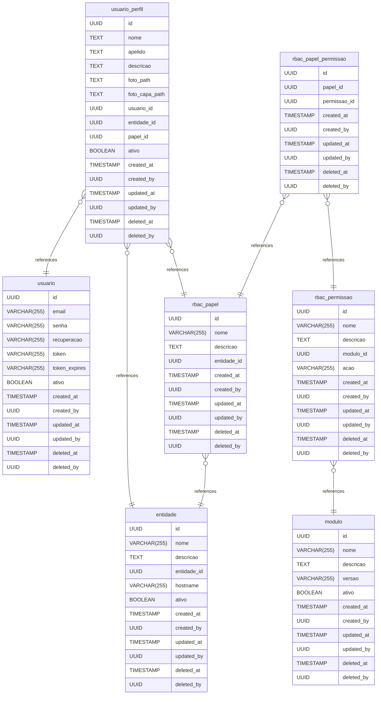

# tenant-diagram documentation
## Summary

- [Introduction](#introduction)
- [Database Type](#database-type)
- [Table Structure](#table-structure)
	- [entidade](#entidade)
	- [usuario](#usuario)
	- [usuario_perfil](#usuario_perfil)
	- [rbac_papel](#rbac_papel)
	- [rbac_papel_permissao](#rbac_papel_permissao)
	- [rbac_permissao](#rbac_permissao)
	- [modulo](#modulo)
- [Relationships](#relationships)
- [Database Diagram](#database-diagram)

## Introduction

## Database type

- **Database system:** PostgreSQL
## Table structure

### entidade
Tabela utilizada para armazenar as tenants/filiais/unidades/empresas em hierarquia.
| Name        | Type          | Settings                      | References                    | Note                           |
|-------------|---------------|-------------------------------|-------------------------------|--------------------------------|
| **id** | UUID | 🔑 PK, not null, unique |  | |
| **nome** | VARCHAR(255) | null |  | |
| **descricao** | TEXT | null |  | |
| **entidade_id** | UUID | null |  |UUID da entidade pai. caso seja uma entidade raiz, deixar como null. |
| **hostname** | VARCHAR(255) | null |  | |
| **ativo** | BOOLEAN | not null |  | |
| **created_at** | TIMESTAMP | not null |  | |
| **created_by** | UUID | not null |  | |
| **updated_at** | TIMESTAMP | null |  | |
| **updated_by** | UUID | null |  | |
| **deleted_at** | TIMESTAMP | null |  | |
| **deleted_by** | UUID | null |  | | 

### usuario

| Name        | Type          | Settings                      | References                    | Note                           |
|-------------|---------------|-------------------------------|-------------------------------|--------------------------------|
| **id** | UUID | 🔑 PK, not null, unique |  | |
| **email** | VARCHAR(255) | not null, unique |  | |
| **senha** | VARCHAR(255) | not null |  | |
| **recuperacao** | VARCHAR(255) | null |  | |
| **token** | VARCHAR(255) | null |  | |
| **token_expires** | VARCHAR(255) | null |  | |
| **ativo** | BOOLEAN | not null |  | |
| **created_at** | TIMESTAMP | not null |  | |
| **created_by** | UUID | not null |  | |
| **updated_at** | TIMESTAMP | null |  | |
| **updated_by** | UUID | null |  | |
| **deleted_at** | TIMESTAMP | null |  | |
| **deleted_by** | UUID | null |  | | 

### usuario_perfil
Tabela para armazenar os perfis do usuário.
| Name        | Type          | Settings                      | References                    | Note                           |
|-------------|---------------|-------------------------------|-------------------------------|--------------------------------|
| **id** | UUID | 🔑 PK, not null, unique |  | |
| **nome** | TEXT | null |  | |
| **apelido** | TEXT | not null |  | |
| **descricao** | TEXT | null |  | |
| **foto_path** | TEXT | null |  | |
| **foto_capa_path** | TEXT | null |  | |
| **usuario_id** | UUID | not null | fk_001_usuario_perfil_usuario | |
| **entidade_id** | UUID | not null | fk_002_usuario_perfil_entidade | |
| **papel_id** | UUID | not null | fk_003_usuario_perfil_papel | |
| **ativo** | BOOLEAN | not null |  | |
| **created_at** | TIMESTAMP | not null |  | |
| **created_by** | UUID | not null |  | |
| **updated_at** | TIMESTAMP | null |  | |
| **updated_by** | UUID | null |  | |
| **deleted_at** | TIMESTAMP | null |  | |
| **deleted_by** | UUID | null |  | | 

### rbac_papel

| Name        | Type          | Settings                      | References                    | Note                           |
|-------------|---------------|-------------------------------|-------------------------------|--------------------------------|
| **id** | UUID | 🔑 PK, not null, unique |  | |
| **nome** | VARCHAR(255) | not null |  | |
| **descricao** | TEXT | null |  | |
| **entidade_id** | UUID | not null | fk_rbac_papel_entidade_id_entidade | |
| **created_at** | TIMESTAMP | not null |  | |
| **created_by** | UUID | not null |  | |
| **updated_at** | TIMESTAMP | null |  | |
| **updated_by** | UUID | null |  | |
| **deleted_at** | TIMESTAMP | null |  | |
| **deleted_by** | UUID | null |  | | 

### rbac_papel_permissao

| Name        | Type          | Settings                      | References                    | Note                           |
|-------------|---------------|-------------------------------|-------------------------------|--------------------------------|
| **id** | UUID | 🔑 PK, not null |  | |
| **papel_id** | UUID | not null | fk_004_papel_permissao_papel | |
| **permissao_id** | UUID | not null | fk_005_papel_permissao_permissao | |
| **created_at** | TIMESTAMP | not null |  | |
| **created_by** | UUID | not null |  | |
| **updated_at** | TIMESTAMP | null |  | |
| **updated_by** | UUID | null |  | |
| **deleted_at** | TIMESTAMP | null |  | |
| **deleted_by** | UUID | null |  | | 

### rbac_permissao

| Name        | Type          | Settings                      | References                    | Note                           |
|-------------|---------------|-------------------------------|-------------------------------|--------------------------------|
| **id** | UUID | 🔑 PK, not null, unique |  | |
| **nome** | VARCHAR(255) | not null |  | |
| **descricao** | TEXT | null |  | |
| **modulo_id** | UUID | not null | fk_006_permissao_modulo | |
| **acao** | VARCHAR(255) | not null |  | |
| **created_at** | TIMESTAMP | not null |  | |
| **created_by** | UUID | not null |  | |
| **updated_at** | TIMESTAMP | null |  | |
| **updated_by** | UUID | null |  | |
| **deleted_at** | TIMESTAMP | null |  | |
| **deleted_by** | UUID | null |  | | 

### modulo

| Name        | Type          | Settings                      | References                    | Note                           |
|-------------|---------------|-------------------------------|-------------------------------|--------------------------------|
| **id** | UUID | 🔑 PK, not null, unique |  | |
| **nome** | VARCHAR(255) | not null |  | |
| **descricao** | TEXT | null |  | |
| **versao** | VARCHAR(255) | not null |  | |
| **ativo** | BOOLEAN | not null |  | |
| **created_at** | TIMESTAMP | not null |  | |
| **created_by** | UUID | not null |  | |
| **updated_at** | TIMESTAMP | null |  | |
| **updated_by** | UUID | null |  | |
| **deleted_at** | TIMESTAMP | null |  | |
| **deleted_by** | UUID | null |  | | 

## Relationships

- **usuario_perfil to usuario**: many_to_one
- **usuario_perfil to entidade**: many_to_one
- **usuario_perfil to rbac_papel**: many_to_one
- **rbac_papel_permissao to rbac_papel**: many_to_one
- **rbac_papel_permissao to rbac_permissao**: many_to_one
- **rbac_permissao to modulo**: many_to_one
- **rbac_papel to entidade**: many_to_one

## Database Diagram

